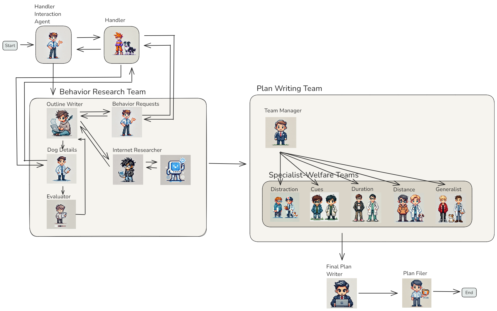

<!--  -->
<div style="display: flex; justify-content: center; align-items: center;">
    
</div>

# AI Agents for Animal Training Plan Generation


## Installation

### Requirements
- Python 3.11 (LangGraph CLI only supports Python >= 3.11.)
- OpenAI API Key (if you want to use the default LLM gtp-4o-mini)
- Tavily API Key (if you want to use the *Internet Research Agent*)

### Installation
1. Clone the repository

    `git clone https://github.com/Tier-Wohl-Team/AIAgents_TrainingPlan.git`
2. change into directory

    `cd AIAgents_TrainingPlan`
3. Create virtual environment
   
    (i) If your python version is < 3.11, you might use conda to build a 3.11 environment

       ```
       conda create -n AIAgents_TrainingPlan python=3.11
       conda activate
       ```
    (ii) **Or** use venv

       ```
       python3 -m venv AIAgents_TrainingPlan`
       source AIAgents_TrainingPlan/bin/activate
       ```
4. Install the required packages using pip (in local environment)

   `pip install -r requirements.txt`
5. Add your API keys

   copy `TrainingPlan_Team/.env_sample` to `TrainingPlan_Team/.env` and add your API keys

## Usage

### Command line
`python .\start_TrainingPlanTeam.py`

### With LangGraph Studio (local)
see also https://langchain-ai.github.io/langgraph/how-tos/local-studio/

`langgraph dev`

Use `CTRL-C`to stop

### Running Tests
1. Unit Testing

    `pytest -m unit`
2. Integration Testing (calling the LLM)

    `pytest -m integration`
3. Probabilistic Output Validation

    `pytest -m llm`
